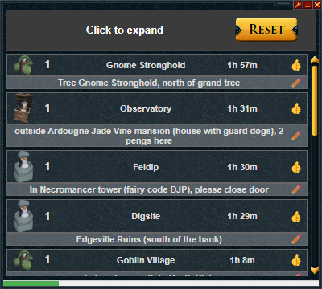
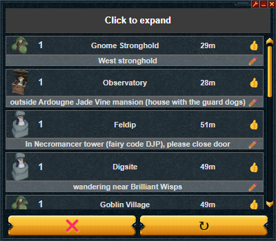
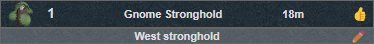
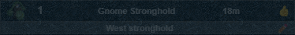

# World 60 Penguins

An [Alt1][alt1_url] plugin that uses the [Penguin Hide & Seek Discord][peng_url]'s API.

---

<<<<<<< HEAD

=======

>>>>>>> 60f0002aa75cda3292a45f64957cf47d1556ac77

| Buttons |            Usage             |
| :-----: | :--------------------------: |
|   ❌    | Clears all checked penguins  |
|    ↻    |    Refreshes all penguins    |
|   ✏️    |  Edit a penguin's location   |
|   👍    | Confirm a penguin's location |

Clicking a penguin toggles it's transparency, making it easier to keep track of penguins.

<<<<<<< HEAD

=======

>>>>>>> 60f0002aa75cda3292a45f64957cf47d1556ac77

---

### Installation

---

**_If you have the [Alt1 Toolkit][alt1_url] installed, paste the `alt1://` link below into your browser:_**

`alt1://addapp/https://seatta.github.io/World-60-Penguins/appconfig.json`

**_[You can also use it in your browser][site_url]_**

---

<!-- ### Potentially Planned Additions

---

- All have been added

 -->

[alt1_url]: https://runeapps.org/alt1
[site_url]: https://seatta.github.io/World-60-Penguins/
[wiki_url]: https://runescape.wiki/w/Penguin_Hide_and_Seek#Current_World_60_Locations
[peng_url]: https://discord.gg/World60Pengs
