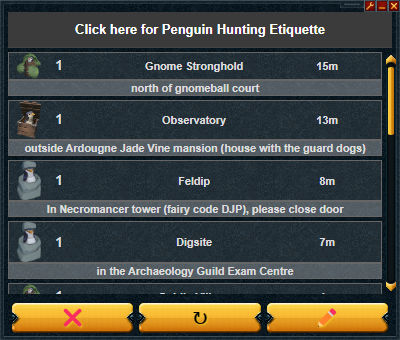
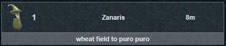
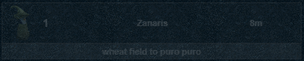

# World 60 Penguins

An [Alt1][alt1_url] plugin that uses the [Penguin Hide & Seek Discord][peng_url]'s API.

---

| Buttons |                  Usage                  |
| :-----: | :-------------------------------------: |
|   ❌    |       Clears all checked penguins       |
|    ↻    |         Refreshes all penguins          |
|   ✏️    | Opens the [wiki page][site_url] for editing |

Clicking a penguin toggles it's transparency, making it easier to keep track of penguins.

---

### Installation

---

**_If you have the [Alt1 Toolkit][alt1_url] installed, paste the `alt1://` link below into your browser:_**

`alt1://addapp/https://seatta.github.io/World-60-Penguins/appconfig.json`

**_[You can also use it in your browser][site_url]_**

---

[alt1_url]: https://runeapps.org/alt1
[site_url]: https://seatta.github.io/World-60-Penguins/
[peng_url]: https://discord.gg/World60Pengs
